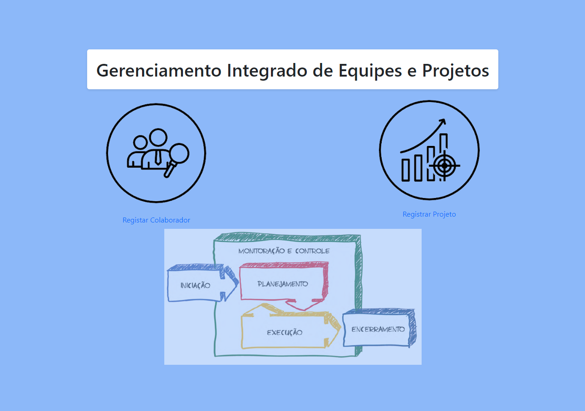

# Gerenciamento Integrado de Equipes e Projetos

Este é um sistema de gerenciamento integrado de equipes e projetos, desenvolvido em PHP com MySQL. Ele permite a colaboração eficiente entre equipes e a gestão de projetos de forma centralizada.

## Tecnologias Utilizadas

- PHP
- MySQL
- HTML
- CSS
- JavaScript
- DataTables

## Recursos Principais

- Cadastro e gerenciamento de colaboradores
- Cadastro e gerenciamento de projetos
- Atribuição de colaboradores a projetos
- Acompanhamento do progresso do projeto

## Instalação

Para rodar este projeto localmente, você precisará do XAMPP instalado em seu sistema. Siga as instruções abaixo:

1. **Instalar o XAMPP:**

   Baixe e instale o XAMPP a partir do site oficial: [https://www.apachefriends.org/index.html](https://www.apachefriends.org/index.html)

2. **Clonar o repositório:**

   ```bash
   git clone https://github.com/ambulcao/project-optigest.git

3. Importar o banco de dados:

- Inicie o XAMPP e certifique-se de que o Apache e o MySQL estejam em execução.
- Acesse o phpMyAdmin no seu navegador: http://localhost/phpmyadmin
- Crie um novo banco de dados chamado optigest.
- Importe o arquivo database.sql localizado no ficheiro scripts -> optigest.sql para o banco de dados recém-criado.

4. Configurar o projeto:

- Navegue até o ficheiro onde o projeto foi clonado.

5. Iniciar o servidor local:

- Inicie o Apache e o MySQL no painel de controle do XAMPP.
- Navegue até http://localhost/optigest no seu navegador para acessar o sistema.

6. Telas

- Tela Principal

Tela inicial do sistema.



- Tela de Colaboradores

Nesta tela, os administradores podem visualizar, adicionar, editar e remover colaboradores. Também é possível atribuir habilidades e funções a cada colaborador.


- Tela de Projetos

Aqui, os usuários podem criar novos projetos, atribuir colaboradores a projetos existentes, definir prazos e acompanhar o progresso do projeto.


7. Contribuição

Contribuições são bem-vindas! Sinta-se à vontade para fazer um fork deste repositório e enviar pull requests com melhorias ou correções.

8. Licença

Este projeto está licenciado sob a Licença MIT.